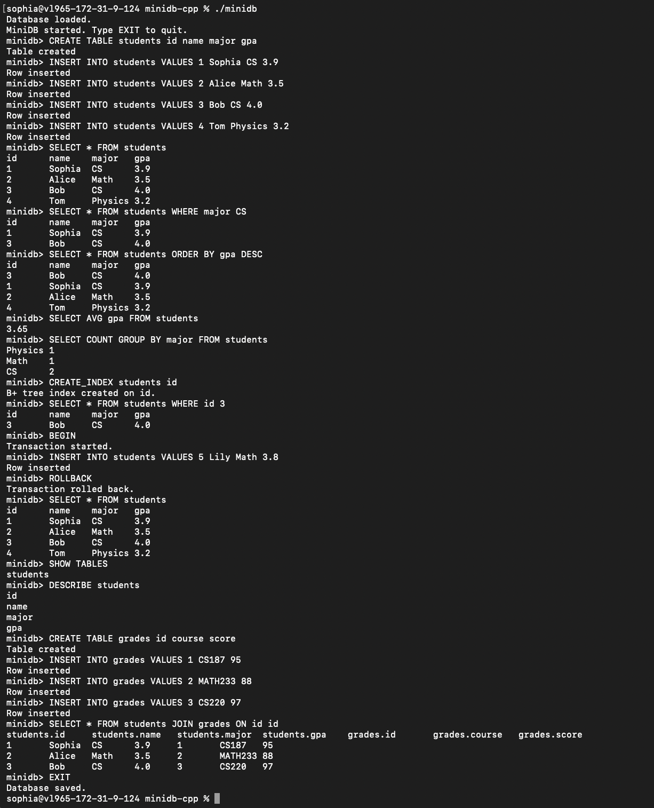

# MiniDB-Cpp

A relational database engine built from scratch in C++ featuring SQL-style query execution, page-based storage, indexing, joins, transactions, and binary persistence.

## Demo



The screenshot above demonstrates table creation, data insertion, indexed lookups, aggregation queries, joins, and transaction management.

---

## Resume Highlights

* Built a relational database engine in C++ supporting SQL-style queries, joins, aggregation, and transactions.
* Implemented page-based storage and binary persistence for durable data storage.
* Developed a B+ Tree indexing layer to accelerate lookup operations.
* Designed an LRU buffer manager to simulate page caching and replacement policies.
* Supported transaction semantics through BEGIN, COMMIT, and ROLLBACK operations.

---

## Overview

MiniDB is a lightweight relational database system designed to explore the core concepts behind modern database engines. The project includes storage management, indexing, query processing, buffering, persistence, and transaction support.

The goal of the project was to gain hands-on experience with database internals and systems programming by implementing many of the components commonly found in production database systems.

---

## Features

### Table Management

* CREATE TABLE
* DROP TABLE
* SHOW TABLES
* DESCRIBE TABLE

### Data Manipulation

* INSERT
* SELECT
* UPDATE
* DELETE

### Query Processing

* WHERE filtering
* ORDER BY
* LIMIT
* DISTINCT

### Aggregation

* COUNT
* MIN
* MAX
* SUM
* AVG
* GROUP BY
* HAVING

### Joins

* INNER JOIN
* LEFT JOIN

### Indexing

* CREATE INDEX
* DROP INDEX
* B+ Tree indexing layer
* Indexed lookups for faster query execution

### Storage Engine

* Page-based storage architecture
* Binary persistence (.db files)
* Metadata management through tables.meta

### Buffer Management

* LRU buffer manager
* Page caching simulation
* Buffer status inspection

### Transactions

* BEGIN
* COMMIT
* ROLLBACK

---

## Architecture

```text
User Query
     │
     ▼
  Parser
     │
     ▼
 Executor
     │
     ▼
 Database
 ┌───┼───────────────┐
 ▼   ▼               ▼
Table Indexes   Transactions
 │      │
 ▼      ▼
Pages  B+ Tree
 │
 ▼
Binary Storage (.db)
```

### Core Components

#### Database

Coordinates tables, indexes, transactions, persistence, and query execution.

#### Table

Stores rows, columns, indexes, and page data.

#### Page

Represents a storage unit used to organize rows within a table.

#### Buffer Manager

Caches pages in memory and applies an LRU replacement policy.

#### B+ Tree

Provides indexed access paths for faster lookup operations.

#### Executor

Parses and executes SQL-like commands.

#### Parser

Tokenizes user input and converts commands into executable operations.

---

## Example Usage

### Create a Table

```sql
CREATE TABLE students id name gpa
```

### Insert Rows

```sql
INSERT INTO students VALUES 1 Sophia 3.9
INSERT INTO students VALUES 2 Alice 4.0
```

### Query Data

```sql
SELECT * FROM students
```

### Filter Rows

```sql
SELECT * FROM students WHERE id 1
```

### Aggregate Data

```sql
SELECT AVG gpa FROM students
```

### Create an Index

```sql
CREATE_INDEX students id
```

### Join Tables

```sql
SELECT * FROM students JOIN grades ON id id
```

### Transactions

```sql
BEGIN
INSERT INTO students VALUES 3 Bob 3.8
COMMIT
```

---

## Building

Compile the project:

```bash
make
```

Run MiniDB:

```bash
./minidb
```

---

## Technologies

* C++17
* STL Containers
* File I/O
* Binary Storage
* B+ Tree Indexing
* LRU Cache Design
* Object-Oriented Design

---

## Technical Highlights

This project provided hands-on experience with:

* Database internals
* Storage engine design
* Indexing structures
* Query execution
* Buffer management
* Binary file formats
* Transaction processing
* Systems programming in C++

---

## Future Improvements

* Fixed-size page storage
* Real B+ Tree node implementation
* Query optimizer
* Write-ahead logging (WAL)
* Crash recovery
* Concurrent transactions
* Multi-threaded execution

---

## Author

**Sophia Zhao**
University of Massachusetts Amherst
B.S. Computer Science
